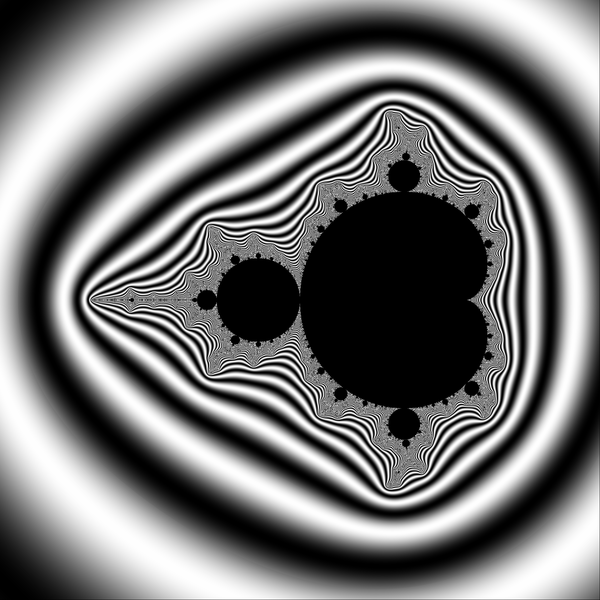
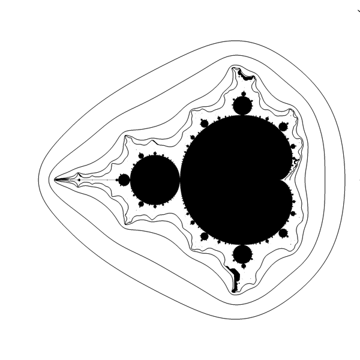
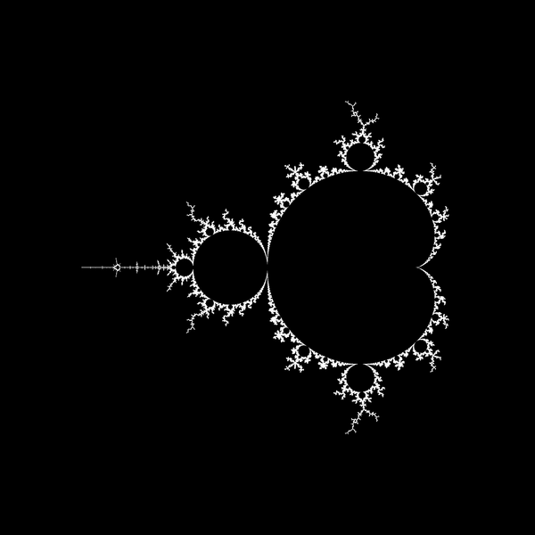
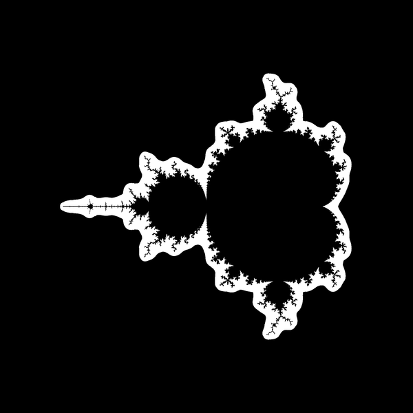
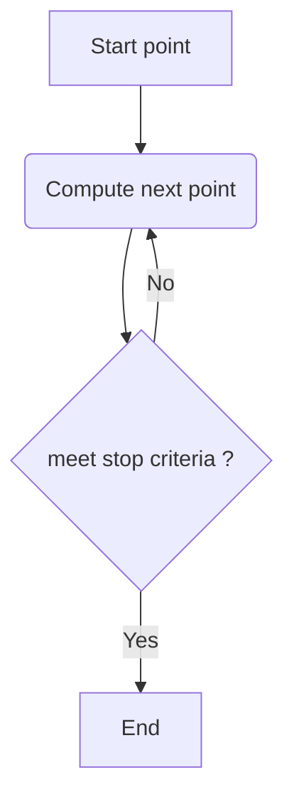
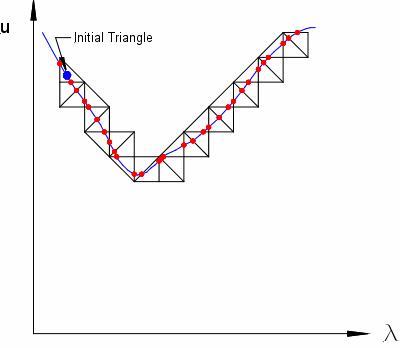

TOC

# code
* [s.c](s.c) - trace equipotential curves on the parameter plane ( my own code))
* [boundary.c](boundary.c) - Boundary Tracing Generation Method, traces the outline of areas of a single color and fills them in. Copyright (c) 1994-1997 Michael R. Ganss. All Rights Reserved.
* [lines.c](lines.c) - detect-lines, extract lines and their width from images. Copyright (C) 1996-1998 Carsten Steger. from [GRASP](http://www.lsc-group.phys.uwm.edu/~ballen/grasp-distribution/)
* [y,c](y.c) - Mandelbrot boundary tracing example for [Youtube video : Writing a Mandelbrot Fractal Renderer with Boundary Tracing Algorithm](https://www.youtube.com/watch?v=rVQMaiz0ydk) – © Joel Yliluoma
* [jung.c](jung.c) - code by [Wolf Jung](http://www.mndynamics.com/indexp.html) (C) 2007-2017  
* [fractint.c](fractint.c) - code for the bound_trace from fractint 


## in other repositories
* [mandelbrot-ex_ray-out](https://gitlab.com/adammajewski/mandelbrot-ex_ray-out)
* [dynamic_external_angle](https://gitlab.com/adammajewski/dynamic_external_angle)
* [m_d_exray_in](https://gitlab.com/adammajewski/m_d_exray_in)
* [ray-backward-iteration](https://gitlab.com/adammajewski/ray-backward-iteration)
* [NonInteractiveParameterRayInMPFR](https://gitlab.com/adammajewski/NonInteractiveParameterRayInMPFR)
* [dynamic_ray_newton](https://gitlab.com/c_files/dynamic_ray_newton)
* [parameter_ray_in_newton_mpfr](https://gitlab.com/c_files/parameter_ray_in_newton_mpfr)


# cases
* dimension : 2D / 3D / ...
* input
  * trace a curve in the array of precomputed values ( read value of new point from the array). Array = image 
  * trace a curve in complex 2D plane ( compute each point)
* curve types 
  * closed / not closed ( ray)
  * simple,   
  * critical points / [singularities ](https://en.wikipedia.org/wiki/Singular_point_of_a_curve)
* grid
  * structured / unstructured
  * quadratic / triangular ( Coxeter-Freudenthal decomposition (triangulation))
* [pixel connectivity](https://en.wikipedia.org/wiki/Pixel_connectivity)
* stoping criteria
  * boundary of the Grid ( image)
  * maximal curve length
  * Maximum compute time 
* trace 
  * forward / backward   or clockwise/counterclockwise
  * how many seed points
  * [fixed step / change ](https://www.khanacademy.org/math/multivariable-calculus/multivariable-derivatives/partial-derivative-and-gradient-articles/a/the-gradient)
  * algorithm  
  


## equipotentials

Exterior is coloured with potential ( grayscale)   
```c
p = log(potential)/K;
color = 255* (1+cos(TwoPi*p))/2.0;
```  

  

Exterior is white with black equipotential curves    
  

Boundary using noise detection  

```c
double BoundaryMeasure = 1.15; // higher value = thinner boundary
// FindBoundary
if (NoiseMeasure> BoundaryMeasure) A[i] = 255 ;	// white
```  
  
     
Noise pixels  
```c
double NoiseMeasureThreshold = 0.045; // arbitrary for c = 0.365000000000000  +0.000000000000000 i    period = 0 
//  FindNoisyPixels
if (NoiseMeasure> NoiseMeasureThreshold) A[i] = 255 ;	// white
```  

  


## field lines = external rays 

here field lines are [external rays](https://en.wikipedia.org/wiki/External_ray)
* do not cross with each other but 2 or more lines may land on the same point ( root or Misiurewicz point)  
* are [perpendicular ( normal)](https://www.intmath.com/applications-differentiation/1-tangent-normal.php) to equipotential lines


# Text output of the program:   


```bash
memory is OK 

real	0m28,965s
user	3m47,483s
sys	0m0,092s

render image = compute and write image data bytes to the array 
File 10_89990.pgm saved. 
ClearExterior =  make exterior solid color = white
 exterior p = 0.751188 

draw equipotential curve thru point c = (0.9000000000000000; 0.0000000000000000) pixel = (1916, 1000)
 	start point
	for c = (0.900000;0.000000)	noise measure = 0.0025952006903814	potential = 0.9901006463279854
	c is inside the array : iy = 1916 iy = 1000	and outside M set
	end point	ix = 1916 iy = 1000 i = 2001916 potential = 0.9901033608952807
	curve is closed = stop ( good) after 4357 steps (pixels)


draw equipotential curve thru point c = (0.7000000000000000; 0.0000000000000000) pixel = (1805, 1000)
 	start point
	for c = (0.700000;0.000000)	noise measure = 0.0045160797467720	potential = 0.5989907665960282
	c is inside the array : iy = 1805 iy = 1000	and outside M set
	end point	ix = 1805 iy = 1000 i = 2001805 potential = 0.5989911428328348
	curve is closed = stop ( good) after 3825 steps (pixels)


draw equipotential curve thru point c = (0.5000000000000000; 0.0000000000000000) pixel = (1694, 1000)
 	start point
	for c = (0.500000;0.000000)	noise measure = 0.0111195774508909	potential = 0.2128012374973248
	c is inside the array : iy = 1694 iy = 1000	and outside M set
	end point	ix = 1694 iy = 1000 i = 2001694 potential = 0.2127903458916913
	curve is closed = stop ( good) after 3687 steps (pixels)


draw equipotential curve thru point c = (0.4000000000000000; 0.0000000000000000) pixel = (1638, 1000)
 	start point
	for c = (0.400000;0.000000)	noise measure = 0.0244119823222931	potential = 0.0632189280903892
	c is inside the array : iy = 1638 iy = 1000	and outside M set
	end point	ix = 1638 iy = 1000 i = 2001638 potential = 0.0631906592052049
	curve is closed = stop ( good) after 4125 steps (pixels)

File 10_89980.pgm saved. 
Find boundary of Mandelbrot set using  noise measure
File 10_89970.pgm saved. 
Find noisy pixels
File 10_89960.pgm saved. 
for c = (0.000000;0.000000)	noise measure = 0.0000000000000000	potential = 0.0000000000000000
for c = (0.100000;0.000000)	noise measure = 0.0000000000000000	potential = 0.0000000000000000
for c = (0.200000;0.000000)	noise measure = 0.0000000000000000	potential = 0.0000000000000000
for c = (0.250000;0.000000)	noise measure = 0.2500000000000000	potential = 0.0000000000000000
for c = (0.260000;0.000000)	noise measure = 3.1457717601949291	potential = 0.0000000019934531
for c = (0.270000;0.000000)	noise measure = 0.5572597205697883	potential = 0.0000044162911707
for c = (0.280000;0.000000)	noise measure = 0.3078640888246843	potential = 0.0000587486278177
for c = (0.290000;0.000000)	noise measure = 0.1872334952074938	potential = 0.0003708182242248
for c = (0.300000;0.000000)	noise measure = 0.1290122547411083	potential = 0.0012438403001236
for c = (0.350000;0.000000)	noise measure = 0.0457918910257952	potential = 0.0183838747379665
for c = (0.400000;0.000000)	noise measure = 0.0244119823222931	potential = 0.0632189280903892
for c = (0.450000;0.000000)	noise measure = 0.0156374406145566	potential = 0.1305368896713344
for c = (0.500000;0.000000)	noise measure = 0.0111195774508909	potential = 0.2128012374973248
for c = (0.600000;0.000000)	noise measure = 0.0066430404569894	potential = 0.3984187631443595
for c = (0.700000;0.000000)	noise measure = 0.0045160797467720	potential = 0.5989907665960282
for c = (0.800000;0.000000)	noise measure = 0.0033359942064616	potential = 0.7958924429230689
for c = (0.900000;0.000000)	noise measure = 0.0025952006903814	potential = 0.9901006463279854
for c = (1.000000;0.000000)	noise measure = 0.0020908718498594	potential = 1.1743374869011141


Parameter plane with Mandelbrot set
corners: CxMin = -2.550000	CxMax = 1.050000	 CyMin = -1.800000	 CyMax 1.800000
corners: ixMin = 0	ixMax = 1999	 iyMin = 0	 iyMax 1999
exterior = CPM/M
IterationMax = 90000
EscapeRadius = 10
iPixelRadius = ixMax* 0.002 = 1 so big pixel = 4 (small) pixels 
```

[Why real time is lower then user time ? ](https://unix.stackexchange.com/questions/40694/why-real-time-can-be-lower-than-user-time)

# dictionary

tracing a curve means compute successive points on the curve, one by one, until stopping criteria are met





Tracing a curve on the triangular grid  
   
[Image by Michael E. Henderson](https://commons.wikimedia.org/wiki/File:Simplicial.gif) 

"scanning means to check every pixel". Other names : detection, extraction


# links
* [Argument tracing by Wolf Jung](http://www.mndynamics.com/indexp.html#XR)
  * [code in wikibooks](https://en.wikibooks.org/wiki/Fractals/mandel#Argument_tracing)
* [A Rasterizing Algorithm for Drawing Curves by Alois Zingl](http://members.chello.at/easyfilter/bresenham.pdf)
* [Meandering triangles ( marching triangles)](https://en.wikipedia.org/wiki/Marching_squares#Meandering_triangles)
* [Otis by Tomoki Kawahira](http://www.math.titech.ac.jp/~kawahira/programs/aboutotis.html)
* [Numerical_continuation](https://en.wikipedia.org/wiki/Numerical_continuation)
  * [Piecewise_linear_continuation](https://en.wikipedia.org/wiki/Piecewise_linear_continuation)
* [Isoline ](http://debian.man.ac.uk/.f/pub/cgu/iavsc/avs5/Module_Src/mappers/Isoline_Slice/Isoline_Slic.html)
* [CURVE TRACING AND CURVE DETECTION IN IMAGES by Karthik Raghupathy](http://citeseerx.ist.psu.edu/viewdoc/download?doi=10.1.1.571.3262&rep=rep1&type=pdf)
* curve tracing algorithm, proposed by Steger 
  * [Carsten Steger, “An unbiased detector of curvilinear structures,” IEEE Transactions on Pattern Analysis and Machine Intelligence, February 1998.](http://citeseerx.ist.psu.edu/viewdoc/download?doi=10.1.1.42.2266&rep=rep1&type=pdf)
  * [Unbiased Extraction of Curvilinear Structures from 2D and 3D Images by Carsten Steger](https://iuks.in.tum.de/_media/members/steger/publications/1998/diss-1998-steger.pdf)
  * [Curviliniar_Detector in matlab by Emmanouil Kapernaros](https://github.com/kapcom01/Curviliniar_Detector)
  * [Curve tracing by Eugene Katrukha](http://katpyxa.info/feedbacks/?p=154) and [code ](https://github.com/jalmar/CurveTracing)
  * [Ridge (Line) Detection Plugin (Fiji) by Thorsten Wagner, Mark Hiner](http://imagej.net/Ridge_Detection) and [code](https://github.com/thorstenwagner/ij-ridgedetection)


# see also

## Recursive subdivision 
* The process of subdividing an object (either geometric object, or a data structure) recursively until some criteria is met.

## Image noise
* [Image noise in wikibooks](https://en.wikibooks.org/wiki/Fractals/Image_noise)

## Feature detection
* [Feature detection in computer_vision](https://en.wikipedia.org/wiki/Feature_detection_(computer_vision))


### boundary scaning
* [Boundary Scanning by Robert P. Munafo](http://mrob.com/pub/muency/boundaryscanning.html)
* [How to “inform” successive ContourPlot calculations in Mathematica?](https://mathematica.stackexchange.com/questions/103673/how-to-inform-successive-contourplot-calculations/103681)


### boundary tracing
* [wikipedia : Boundary_tracing](https://en.wikipedia.org/wiki/Boundary_tracing)
* [The Boundary Tracing algorithm by Evgeny Demidov](https://www.ibiblio.org/e-notes/MSet/big_m.htm)
* [Fast Contour-Tracing Algorithm Based on a Pixel-Following Method for Image Sensors by Jonghoon Seo, et al.](https://www.ncbi.nlm.nih.gov/pmc/articles/PMC4813928/)
* [Tracing Boundaries in 2D Images by V. Kovalevsky](http://www.kovalevsky.de/Topology/Algorithms_2D_e.htm)
* [the Moore-Neighbor tracing algorithm by Abeer George Ghuneim ](http://www.imageprocessingplace.com/downloads_V3/root_downloads/tutorials/contour_tracing_Abeer_George_Ghuneim/moore.html)  
* [Square Tracing Algorithm by Abeer George Ghuneim ](http://www.imageprocessingplace.com/downloads_V3/root_downloads/tutorials/contour_tracing_Abeer_George_Ghuneim/square.html) 
* [comturs in OpenCV and Python](http://opencv-python-tutroals.readthedocs.io/en/latest/py_tutorials/py_imgproc/py_contours/py_table_of_contents_contours/py_table_of_contents_contours.html)
* [Bisqwit]()


### contour tracing
* [Drawing M-set by contour lines method](https://groups.google.com/forum/#!topic/sci.fractals/t9Udefcs20Q)
  * [M. Romera, G. Pastor and F. Montoya, "Graphic Tools to Analyse One-Dimensional Quadratic Maps", Computers & Graphics, 20/2 (1996), 333-339 ](http://www.tic.itefi.csic.es/gerardo/publica/Romera96.pdf)
  * M. Romera, G. Pastor and F. Montoya, "Drawing the Mandelbrot set by the method of escape lines", Fractalia, 5, n.º 17 (1996), 11-13.
* [an explicit conformal isomorphism between the complement of the Mandelbrot set M and the complement of the closed unit disk D](https://math.stackexchange.com/questions/748875/demonstrating-that-the-mandelbrot-set-is-connected)
* [CONREC = A Contouring algorithm of some surface represented as a regular triangular mesh by Paul Bourke](http://paulbourke.net/papers/conrec/)
### Contour scanning or edge detection
* [wikibooks](https://en.wikibooks.org/wiki/Fractals/Computer_graphic_techniques/2D#Edge_detection)

### streamline tracing
* [HARSH BHATIA](http://www.sci.utah.edu/~hbhatia/research.php)
* [stackoverflow question: how-to-plot-streamlines-when-i-know-u-and-v-components-of-velocitynumpy-2d-ar](https://stackoverflow.com/questions/8296617/how-to-plot-streamlines-when-i-know-u-and-v-components-of-velocitynumpy-2d-ar)
* [stackoverflow question: how-to-create-streamline-like-arrow-lines-in-gnuplot](https://stackoverflow.com/questions/33240722/how-to-create-streamline-like-arrow-lines-in-gnuplot?noredirect=1&lq=1)
* [wikipedia : Image-based_flow_visualization](https://en.wikipedia.org/wiki/Image-based_flow_visualization)
* [Robust Polylines Tracing for N-Symmetry Direction Field on Triangulated Surfaces by NICOLAS RAY and DMITRY SOKOLOV](http://alice.loria.fr/publications/papers/2014/STREAM/RobustStreamlines.pdf)

### Visualization of Algebraic Curves - curve sketching
* [AN ACCURATE ALGORITHM FOR RASTERIZING ALGEBRAIC CURVES by Gabriel Taubin](http://citeseerx.ist.psu.edu/viewdoc/download?doi=10.1.1.72.9588&rep=rep1&type=pdf)
* [Visualizing Arcs of Implicit Algebraic Curves, Exactly and Fast by Pavel Emeliyanenko, Eric Berberich, Michael Sagraloff1](https://people.mpi-inf.mpg.de/~msagralo/curvevisualization.pdf)

# code
* [contour-tracing: c++, OpenCV](https://github.com/aaalgo/contour-tracing/blob/master/contour-tracing.h)
* [Moore Neighbor Contour Tracing Algorithm in C++ BY ERIK SMISTAD](https://www.eriksmistad.no/moore-neighbor-contour-tracing-algorithm-in-c/)  


# Key words
* Digital Topology
* digital image processing
* binary 2D image
* discrete complex dynamics
* complex quadratic polynomial
* parameter plane
* lines tangent and normal to curve at a point 
* trace 
  * a curve
  * a boundary
  * a contour
  * [polylines](https://en.wikipedia.org/wiki/Polygonal_chain)
* curve
  * isocurve ( isoline): equipotential curve
* [FLOW VISUALIZATION](http://www.flowvis.org/)
  * [seed](https://slvg.soe.ucsc.edu/seed.html)
  * [dual seed ](https://www.zib.de/hotz/publications/paper/rosanwo09_dualSeeding.pdf)
* [2D Velocity Fields](http://avis.soe.ucsc.edu/texflow.html)
* Applications:
  *  streamline tracing on triangular and quadrilateral grids
  * Numerical continuation 
    * Simplicial or piecewise linear continuation 
  * Visualization of Algebraic Curves - curve sketching


# technical notes
GitLab uses:
* the Redcarpet Ruby library for [Markdown processing](https://gitlab.com/gitlab-org/gitlab-ce/blob/master/doc/user/markdown.md)
* [KaTeX](https://khan.github.io/KaTeX/) to render [math written with the LaTeX syntax](https://gitlab.com/gitlab-org/gitlab-ce/blob/master/doc/user/markdown.md), but [only subset](https://khan.github.io/KaTeX/function-support.html). [Here is used version](https://github.com/gitlabhq/gitlabhq/blob/a0715f079c143a362a7f6157db45020b8432003e/vendor/assets/javascripts/katex.js)


## git ( gitlab)

```
cd existing_folder
git init
git remote add origin git@gitlab.com:adammajewski/curve-tracing.git
git add .
git commit -m "Initial commit"
git push -u origin master
```

