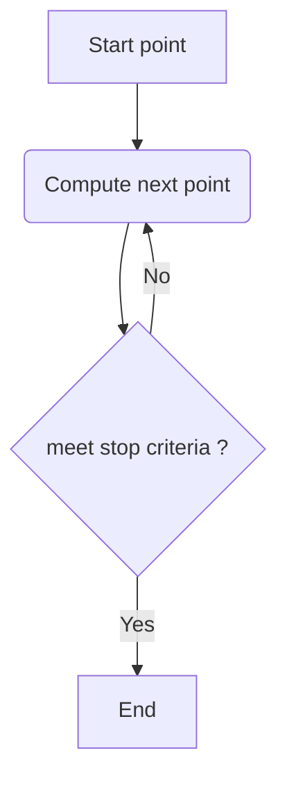

TOC


# dictionary

## tracing 



## scanning
* "scanning means to check every pixel"

# cases
* trace a curve in the array of precomputed values ( read value of new point from the array). Array = image 
* trace a curve in complex 2D plane ( compute each point)

# curve types
* closed / not closed ( ray)
* simple, 

## equipotentials


# code
* [boundary.c](boundary.c) - Boundary Tracing Generation Method, traces the outline of areas of a single color and fills them in. Copyright (c) 1994-1997 Michael R. Ganss. All Rights Reserved.
* [s.c](s.c) - trace equipotential curves on the parameter plane
* [mandelbrot-ex_ray-out](https://gitlab.com/adammajewski/mandelbrot-ex_ray-out)
* [dynamic_external_angle](https://gitlab.com/adammajewski/dynamic_external_angle)
* [m_d_exray_in](https://gitlab.com/adammajewski/m_d_exray_in)
* [ray-backward-iteration](https://gitlab.com/adammajewski/ray-backward-iteration)
* [NonInteractiveParameterRayInMPFR](https://gitlab.com/adammajewski/NonInteractiveParameterRayInMPFR)
* [dynamic_ray_newton](https://gitlab.com/c_files/dynamic_ray_newton)
* [parameter_ray_in_newton_mpfr]https://gitlab.com/c_files/parameter_ray_in_newton_mpfr


# links
* [Argument tracing by Wolf Jung](http://www.mndynamics.com/indexp.html#XR)
  * [code in wikibooks](https://en.wikibooks.org/wiki/Fractals/mandel#Argument_tracing)
* [The Boundary Tracing algorithm by Evgeny Demidov](https://www.ibiblio.org/e-notes/MSet/big_m.htm)

# see also
* [Boundary Scanning by Robert P. Munafo](http://mrob.com/pub/muency/boundaryscanning.html)
* [How to “inform” successive ContourPlot calculations in Mathematica?](https://mathematica.stackexchange.com/questions/103673/how-to-inform-successive-contourplot-calculations/103681)
* [the Moore-Neighbor tracing algorithm by Abeer George Ghuneim ](http://www.imageprocessingplace.com/downloads_V3/root_downloads/tutorials/contour_tracing_Abeer_George_Ghuneim/moore.html)
* [Drawing M-set by contour lines method](https://groups.google.com/forum/#!topic/sci.fractals/t9Udefcs20Q)
  * [M. Romera, G. Pastor and F. Montoya, "Graphic Tools to Analyse One-Dimensional Quadratic Maps", Computers & Graphics, 20/2 (1996), 333-339 ](http://www.tic.itefi.csic.es/gerardo/publica/Romera96.pdf)
  * M. Romera, G. Pastor and F. Montoya, "Drawing the Mandelbrot set by the method of escape lines", Fractalia, 5, n.º 17 (1996), 11-13.
# Key words
* discrete complex dynamics
* complex quadratic polynomial
* parameter plane
* trace 
  * a curve
  * a boundary
  * a contour


# technical notes
GitLab uses:
* the Redcarpet Ruby library for [Markdown processing](https://gitlab.com/gitlab-org/gitlab-ce/blob/master/doc/user/markdown.md)
* [KaTeX](https://khan.github.io/KaTeX/) to render [math written with the LaTeX syntax](https://gitlab.com/gitlab-org/gitlab-ce/blob/master/doc/user/markdown.md), but [only subset](https://khan.github.io/KaTeX/function-support.html). [Here is used version](https://github.com/gitlabhq/gitlabhq/blob/a0715f079c143a362a7f6157db45020b8432003e/vendor/assets/javascripts/katex.js)


## git ( gitlab)

```
cd existing_folder
git init
git remote add origin git@gitlab.com:adammajewski/curve-tracing.git
git add .
git commit -m "Initial commit"
git push -u origin master
```

